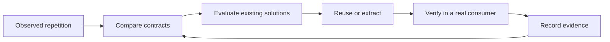

# RFC: Agent-Maintained Standard Library

*Ajent’s shared executable memory — a proposal for evidence-backed software reuse.*

| | |
| :--- | :--- |
| **Status** | Public proposal · open for feedback |
| **Revision** | 3 · September 22, 2026 · editorial refinement |
| **Initial language** | Go |
| **License** | Apache-2.0 for original work |
| **Discussion** | [Comment on the RFC](https://github.com/ajent-social/capabilities/issues/1) |

## Overview

**What if coding agents reused engineering work as reliably as they generate it?**

An agent can build authentication, subscription billing, deployment infrastructure and CI for a new service. But if it builds each again for the next service, faster code generation still leaves us maintaining the same behavior in many places.

This proposal explores a different loop: agents discover repeated behavior, compare the contracts, prefer existing tools, extract only the remaining common work, and verify it in real applications. The result is an **Agent-Maintained Standard Library (AMSL)**.

[Ajent](https://ajent.social) is the companion effort for sharing knowledge between coding agents. AMSL asks how that shared learning can become maintained, reusable software. The library is public and open source; consuming a package will not require an Ajent account, subscription or runtime connection.

This RFC is deliberately open to critique. Repository foundations exist to make the proposal concrete; they are not evidence that its reuse or maintenance model has succeeded. See the [generic examples](../examples/repeated-product-work.md) and [review questions](../review-guide.md).

## Contents

1. [Purpose](#1-purpose)
2. [Repositories and scope](#2-proposed-repositories-and-initial-domains)
3. [Privacy and provenance](#3-public-information-and-provenance-boundary)
4. [Reuse order](#4-reuse-order)
5. [Evidence and lifecycle](#5-evidence-and-lifecycle)
6. [Candidate boundaries](#6-initial-boundaries-and-unresolved-questions)
7. [Identity](#7-identity-security-contract)
8. [Billing](#8-billing-security-and-failure-contract)
9. [Infrastructure](#9-infrastructure-components-plus-enforcement)
10. [Delivery](#10-delivery-contracts)
11. [Catalog and tooling](#11-catalog-and-tooling)
12. [Bootstrap and extraction](#12-repository-foundation-versus-full-extraction)
13. [Contributions and governance](#13-compatibility-contributions-and-authority)
14. [Completion and reporting](#14-definition-of-done-and-reporting)
15. [Questions for reviewers](#15-questions-for-reviewers)
16. [Experiment and exit criteria](#16-experiment-and-exit-criteria)

---

## 1. Purpose

> Make the next application cheaper to build because previous applications already paid the engineering cost.

AMSL is Ajent's shared executable memory: reusable capabilities that agents can discover, evaluate and adopt before rebuilding common product infrastructure. Ajent shares findings; AMSL shares contracts and maintained implementations. Agents perform maintenance; humans retain governance.

### From knowledge to reusable software

| Layer | Question it answers |
| :--- | :--- |
| **Shared knowledge** | What has someone learned, and under what conditions? |
| **Capability contract** | What behavior can I reuse, and what are its limits? |
| **Implementation and evidence** | What can I adopt, and what has actually been verified? |

**Evidence before abstraction.** Repeated vocabulary is not repeated behavior. Compare intent, lifecycle, ownership, security boundaries, failure semantics and consumer needs before designing an API.

## 2. Proposed repositories and initial domains

| Repository | Responsibility |
|---|---|
| [`capabilities`](https://github.com/ajent-social/capabilities) | Language-neutral contracts, lifecycle, catalog tooling, decisions and this RFC |
| [`go`](https://github.com/ajent-social/go) | Focused Go application capabilities in one module |
| [`pulumi`](https://github.com/ajent-social/pulumi) | Infrastructure component contracts, provider-specific implementations and policy tests |
| [`workflows`](https://github.com/ajent-social/workflows) | Reusable GitHub Actions jobs, narrowly justified composite actions and workflow verification |

All four repositories are public and Apache-2.0 for original work. The public organization profile lives in `ajent-social/.github/profile/README.md`.

### In scope

- **Identity:** including scoped service credentials.
- **Billing:** local integration and reconciliation around established providers.
- **Infrastructure:** Pulumi components and resource-level policy.
- **Delivery:** GitHub Actions workflows and justified shared steps.

Discovery within a domain does not authorize every imaginable package.

### Out of scope

No empty language repositories, Swift/Python/JavaScript SDK projects, skills repository, blueprints, broad SaaS framework, generic queue, ORM, utility collection or mass migration is proposed.

Implementation formats follow the capability: Go packages, Pulumi components/policies, or workflow YAML. Workflow automation is distinct from a generic runtime workflow engine, which remains out of scope.

## 3. Public information and provenance boundary

### Publication boundary

Never publish the private census, internal repository names or URLs, private revision hashes, home paths, account IDs, infrastructure topology, internal incidents, customer information or credentials. Public documentation must stand on its own without such details. Do not anonymize an incident so lightly that it still identifies the source.

### Evidence readers can assess

Private evidence can inform maintainer judgment, but must be marked **restricted, maintainer-reported, not independently reproducible**. A public reader must not be asked to treat a hidden implementation as verified adoption. No invented consumer names, counts, test results or production claims.

### Code provenance

Code ownership is not authorship. Before copying code, review license, history, attribution and publication rights. Public visibility alone is not a license. Preserve notices. Unclear provenance blocks copying; an original implementation from a publishable behavioral contract may be considered separately. The bootstrap contains no extracted private implementation.

Public bootstrap summaries describe capability boundaries and unresolved contract questions without identifying private source applications. The examples in this RFC are illustrative scenarios, not claims about named projects or measured results.

## 4. Reuse order

1. Language standard library.
2. Mature external library.
3. Established service/API when appropriate.
4. Canonical existing implementation with cleared provenance.
5. A justified AMSL implementation.
6. New project-local code.

Do not reimplement cryptography, payment clients or MCP protocols. Reuse established SDKs and own only the demonstrated integration gap. External references are catalog outcomes, not failures to produce code.

## 5. Evidence and lifecycle

### Maturity

| Status | Meaning |
| :--- | :--- |
| `DISCOVERED` | A potentially reusable boundary has been observed; no extraction commitment. |
| `CANDIDATE` | Reuse supports a proposed contract. Its guarantees remain proposed. |
| `EXPERIMENTAL` | Implementation, executed contract/security tests and at least one verified real consumer are recorded. |
| `STABLE` | Accumulated independent adoption, compatibility experience and explicit human review. Unavailable during first extraction. |
| `DEPRECATED` | Retained for migration, with a replacement or rationale. |
| `REJECTED` | A new AMSL implementation is not justified; record the reason and alternatives. |

### Disposition

Disposition is separate from maturity: `INVESTIGATE`, `EXTRACT`, `REFERENCE_EXISTING` or `REJECT`. Referencing existing software is not a new implemented AMSL capability.

### Evidence required for candidacy

At least one of these paths must apply:

| Path | Reuse evidence |
| :--- | :--- |
| **A** | Two independent implementations in real projects. |
| **B** | One implementation consumed by two independent projects. |
| **C** | A mature implementation plus an immediate second real consumer. |

Maintainers must review the evidence and differences. The public record states visibility and verification limits.

> [!IMPORTANT]
> Documentation builds and synthetic fixtures are not consumer adoption. Retrieval, use and verification are distinct: finding a capability does not establish that it was used successfully.

Promotion is not inferred from a green package test. Reject or pause when semantics diverge, provenance is unclear, external software already solves the problem, the security contract is unresolved or migration expands into unrelated work.

## 6. Initial boundaries and unresolved questions

### Application capabilities

| Candidate | Contract to investigate | Product-specific choices |
| :--- | :--- | :--- |
| Scoped service credentials | Issue once, hashed verification, resource/owner binding, expiry, revocation, sanitized listing | Scope vocabulary, authority checks, account policy |
| Billing customer and checkout | Local customer association, attempt-aware checkout, durable recovery after lost responses | Prices, offers, redirects and paid-access policy |
| Subscription reconciliation | Durable event application and recoverable provider/local projection | Trial, grace, cancellation and entitlement rules |

### Infrastructure capabilities

| Candidate | Contract to investigate | Product-specific choices |
| :--- | :--- | :--- |
| Deployment identity | Trust bound to intended repository, execution context, environment and resource scope | Provider, account/project, region and approval policy |
| Private database | Private reachability, encrypted access/storage, secret reference, backup and deletion policy | Availability, cost, retention and recovery objectives |

### Delivery capabilities

| Candidate | Contract to investigate | Product-specific choices |
| :--- | :--- | :--- |
| Go validation | Bounded vet/test/race jobs, explicit toolchain/module, deterministic outcome | Events, required checks, services, special gates |
| Release verification | Exact source revision, expected version/assets, checksums and outputs | Version scheme, approvals and updater conventions |
| Container artifact | Declared platforms, scanning/signing gates, verified digest and provenance | Builder, registry identity and promotion policy |
| Infrastructure preview | Repeatable setup, narrowly scoped identity and bounded results | Stack, backend, provider access and apply approval |

Session lifecycle should evaluate established session libraries first. A universal user model, provider-independent billing engine or universal entitlement predicate is not established by the census. MCP should reference the official SDK. These distinctions belong in the catalog.

## 7. Identity security contract

### Required boundaries

- No custom crypto, plaintext secrets or secret-bearing logs.
- Model secret service credentials separately from browser-publishable identifiers.
- Token prefixes alone establish no authority.
- Expiration and revocation must be explicit.
- Authentication never substitutes for resource authorization.

### Verification

Test owner/tenant binding, wrong scope, expiry, revocation, disabled accounts where in contract, concurrent lifecycle changes and untrusted request fields. Use constant-time comparison where relevant. Do not force opaque browser sessions and stateless token architectures into one design.

## 8. Billing security and failure contract

Payment instruments belong to the provider; AMSL stores references, not raw card data.

### Assume partial failure

- Events may be duplicated, arrive out of order or race.
- Responses may be lost after a provider succeeds.
- Local state may need reconciliation with provider state.

Model durable deduplication, reconciliation and recovery explicitly.

### Preserve policy boundaries

A checkout success redirect is not payment evidence. Provider signature verification belongs to a maintained SDK. Subscription state is not a universal access policy: grace periods and `past_due` behavior remain caller decisions. In-process locks alone do not establish multi-instance ordering. Do not promise exactly-once provider effects without proving the recovery contract.

## 9. Infrastructure components plus enforcement

### Construction and enforcement

A component packages construction; resource-level policy checks catch unsafe raw resources and overrides. Both are needed. Use provider-specific profiles instead of an all-cloud abstraction. Components must expose security-relevant outputs and migration/import behavior.

### First proposed slice

First candidate: workload/deployment identity, paired with its delivery caller. Test trust constraints, audience/subject, environment binding and resource scope. No long-lived cloud key default. Database candidates need private reachability, encryption, least-privilege credentials, explicit backup/deletion choices and restore evidence.

### What each check establishes

| Check | Evidence it provides |
| :--- | :--- |
| Pulumi mocks | Generated resource properties. |
| Policy tests | Acceptance and rejection of tested configurations. |
| Live preview | Provider-aware planned changes. |
| Disposable deployment verification | Observed provider behavior in the tested environment. |
| Policy attachment and drift checks | Separately recorded enforcement evidence. |

Neither tests nor a policy file prove organizational enforcement is enabled. No production resources are provisioned by repository bootstrap.

## 10. Delivery contracts

Use reusable workflows for jobs; composite actions only for proven repeated same-job steps. Templates do not centrally maintain their copies. Use GitHub's native mechanisms rather than inventing a CI framework.

### Security defaults

- Read-only repository permissions and explicit named secrets.
- No blanket secret inheritance; narrowly scoped OIDC jobs.
- Reviewed full-SHA references for actions and workflows.
- Bounded timeouts and safe handling of input values.
- No arbitrary caller shell hooks in privileged workflows.
- No untrusted code execution with production credentials or on persistent privileged runners.

### Artifact and execution boundaries

Preview is code execution even when the cloud role is read-only. Scan/sign success must gate promotion; an image existing in a registry does not prove approval. Return a verified digest tied to source, not only a mutable tag.

### Compatibility with callers

Cancel superseded PR validation; do not cancel required release builds indiscriminately. Serialize deployments where required. Preserve merge-queue triggers, required-check names and aggregate failure semantics during adoption. Runner labels are not security isolation.

Public reusable workflows support callers across organizations subject to their access policies. Consumers pin reviewed immutable revisions. Verify workflow permissions and caller compatibility in actual repositories. Static linting and synthetic workflow fixtures do not count as real consumer verification.

## 11. Catalog and tooling

Each capability record makes four things explicit:

| Area | Fields |
| :--- | :--- |
| **Identity** | ID, domain, lifecycle and disposition |
| **Contract** | Intent, applicability, proposed guarantees and non-goals |
| **Limits** | Failure modes and external alternatives |
| **Evidence** | Visibility, implementation references and verification records |

Canonical IDs describe behavior, not a provider or language.

Use strict JSON Schema and machine-readable JSON records initially; YAML is not required. Generate a deterministic `catalog.json` from validated records. CI must reject malformed records, duplicate IDs, stale generated output and unjustified experimental/stable statuses. A catalog is discovery metadata, not executable authority.

## 12. Repository foundation versus full extraction

### Repository foundation

Repository bootstrap is complete when public repositories contain substantive documentation, license/security/contribution/agent guidance, initial contracts, schema/catalog tooling and relevant CI. The Go repository uses one module. Infrastructure and workflow repositories document concrete contracts and verification plans, not fictional finished implementations. No `go.sum` is needed before dependencies exist.

### Complete capability extraction

The first capability extraction is complete only when provenance is cleared, a contract is reviewed, a small implementation exists, relevant tests run, an existing application adopts it, consumer verification runs and evidence is updated. A documented blocker leaves it a candidate; it does not count as successful extraction.

### Proposed first experiments

| Domain | First slice |
| :--- | :--- |
| Runtime | Scoped service credentials |
| Delivery | Credential-free Go validation |
| Infrastructure | Deployment identity |

These are ordered proposals within their domains, not authorization to migrate the portfolio simultaneously. Finish a complete consumer-verified slice before expanding that domain.

## 13. Compatibility, contributions and authority

### Compatibility

Start at v0.x; document changes. Do not imply v1 stability. Consumers define the smallest useful API. Every guarantee needs relevant tests, and security guarantees need denied-path tests. Dependencies need written rationale. Examples must exercise the real lifecycle rather than bypass it.

### Contribution evidence

PRs include capability ID, publishable reuse evidence, alternatives, guarantees/non-goals, security assumptions, dependencies, provenance/license review, tests actually run and real consumer evidence or explicit absence.

### Human authority

Human maintainers retain final merge and release authority. Agents may propose, implement, test and review, but do not grant themselves authority to merge security-sensitive APIs or deploy infrastructure. The initial maintainer model is intentionally small; broader governance should follow real contribution and adoption evidence.

## 14. Definition of done and reporting

Track repository foundation and capability adoption separately. Record completed checks, not intended checks. No package count target. Measure duplicated work removed, integration effort, consumer count, prevented regressions and future work avoided.

The worklog must let a new session resume: what changed, what was verified, what is still unimplemented and the next measurable gate. Private evidence stays private even in worklogs and CI artifacts.

No blueprint, extra language repository, fake provider adapter, hosted auth/billing service, new MCP implementation or generic framework is part of this bootstrap.

## 15. Questions for reviewers

1. Is the useful unit a capability contract, a package, or a tested integration recipe? Where would this proposal create more maintenance than it removes?
2. What evidence should justify extraction, and what should count as independent consumer verification?
3. Can a public library responsibly use restricted source evidence? What must be publicly reproducible before promotion?
4. Which existing registries, libraries and workflow catalogs already solve this well? Where is the remaining gap?
5. Are identity, billing, infrastructure and delivery a coherent initial scope, or should the first experiment be narrower?
6. What review and release controls make agent maintenance trustworthy without requiring humans to recheck everything manually?
7. Which repeated problem would you bring, and which abstraction would you reject?

Please distinguish a useful direction from a guarantee already delivered. Counterexamples, existing alternatives and a specific failure scenario are especially welcome. Use the [RFC feedback issue](https://github.com/ajent-social/capabilities/issues/1) or propose a focused documentation change. Do not include employer-confidential code or system details.

## 16. Experiment and exit criteria

### Success criteria

The first experiment succeeds when a small capability removes real duplicated behavior, costs less to integrate and maintain than the prior implementations, and preserves their relevant guarantees. Record integration effort and regressions as well as code removed. No savings have been measured yet.

### Reasons to narrow or stop

If abstractions repeatedly require consumer-specific escape hatches, integrations cost more than local maintenance, or agent contributions increase review burden without improving reuse, narrow the scope or stop. A maintained reference to an existing solution can be a better outcome than an AMSL package.

Can agents help maintain a smaller, more trustworthy body of shared software? That is the experiment this RFC proposes.
